## Introduction

[AWS Application Migration Service (AWS
MGN)](https://aws.amazon.com/application-migration-service/) is the
automated lift-and-shift service that facilitates server migrations to
AWS at scale. [AWS Elastic Disaster Recovery (AWS
DRS)](https://aws.amazon.com/disaster-recovery/) is the service which
increases resilience of both on-premises and cloud-based applications by
replicating data to AWS. Customers using AWS MGN or AWS DRS are required
to perform manual setup and initialization tasks. There are several
steps to enable these services using the AWS Console or the [AWS
CLI](https://aws.amazon.com/cli/), some of which require administrator
permissions. Use of administrator permissions is commonly restricted in
enterprise environments, leading to dependencies on external teams to
perform administrative actions. This blog demonstrates how you can
automate the initialization and setup of AWS MGN and AWS DRS leveraging
[AWS Service Catalog](https://aws.amazon.com/servicecatalog/) based
automation. With AWS Service Catalog based automation, the AWS MGN and
AWS DRS initialization process is streamlined in a multi-account
environment, so teams can easily setup these services at scale.

## Solution Overview

This solution automates the initialization and default replication
configuration setup for AWS MGN and AWS DRS using AWS Service Catalog
Products, making migration and disaster recovery capabilities more
easily accessible to application teams in their AWS Accounts. A Service
Catalog Portfolio makes sharing the service initialization automation
with multiple accounts in [AWS
Organizations](https://aws.amazon.com/organizations/) seamless. The
Service Catalog Portfolio consists of two Products, which automate the
initialization and creation of the default replication configurations
for AWS MGN and AWS DRS services. Figure 1 shows an example AWS
Organization structure in which the AWS MGN and AWS DRS Service Catalog
Products are shared from [the AWS Organizations Management Account or a
delegated administrator
account](https://docs.aws.amazon.com/servicecatalog/latest/adminguide/catalogs_portfolios_sharing.html#portfolio-sharing-organizations).
For more details on how you can simplify the process of sharing Service
Catalog Portfolios in your AWS Organization, please refer to
documentation on [Sharing Service Catalog
Portfolios](https://docs.aws.amazon.com/servicecatalog/latest/adminguide/catalogs_portfolios_sharing.html#portfolio-sharing-organizations) and
[Simplify sharing your AWS Service Catalog portfolios in an AWS
Organizations
setup](https://aws.amazon.com/blogs/mt/simplify-sharing-your-aws-service-catalog-portfolios-in-an-aws-organizations-setup/).

 
#### Figure 1: AWS Organizations and Service Catalog Portfolio Sharing

The AWS MGN and AWS DRS initialization and replication configuration
steps are automated with Service Catalog [AWS
CloudFormation](https://aws.amazon.com/cloudformation/) Products and
[CloudFormation custom
resources](https://docs.aws.amazon.com/AWSCloudFormation/latest/UserGuide/template-custom-resources.html).
The custom resources deploy Python based Lambda functions and use the
[AWS SDK for Python
(Boto3)](https://boto3.amazonaws.com/v1/documentation/api/latest/index.html) to
make AWS MGN and AWS DRS API calls to initialize the services. For more
details on the initialization steps, please see [AWS DRS initialization
and
permissions](https://docs.aws.amazon.com/drs/latest/userguide/getting-started-initializing.html)
and [AWS MGN initialization and
permissions](https://docs.aws.amazon.com/mgn/latest/ug/mgn-initialize-api.html).

## Prerequisites

For this post, you should have basic knowledge of GitHub repositories
and the following AWS services:

1.  [AWS Identity and Access Management
    (IAM)](https://aws.amazon.com/iam/?trk=da94b437-337f-4ee7-81b4-5dcf158370ab&sc_channel=ps&ef_id=EAIaIQobChMIuun-6MymgQMV79vICh1XvwJ-EAAYASAAEgKqofD_BwE:G:s&s_kwcid=AL!4422!3!651737511584!p!!g!!iam!19845796027!146736269709)
2.  [AWS Cloud9](https://aws.amazon.com/cloud9/)
3.  [Amazon Simple Storage Service (Amazon
    S3)](https://aws.amazon.com/s3/)
4.  [AWS Organizations](https://aws.amazon.com/organizations/)
5.  [AWS CloudFormation](https://aws.amazon.com/cloudformation/)
6.  [AWS Service Catalog](https://aws.amazon.com/servicecatalog/)
7.  [AWS Application Migration
    Service](https://aws.amazon.com/application-migration-service/)
8.  [AWS Elastic Disaster
    Recovery](https://aws.amazon.com/disaster-recovery/)
9.  [AWS CLI](https://aws.amazon.com/cli/)
10. [Amazon Virtual Private Cloud (Amazon
    VPC)](https://aws.amazon.com/vpc/)

It is assumed that you have the following prerequisites:

1.  AWS Organizations
2.  IAM User or Role to assume in the [management account or a delegated
    administrator account for AWS Service
    Catalog](https://docs.aws.amazon.com/servicecatalog/latest/adminguide/catalogs_portfolios_sharing_how-to-share.html#portfolio-sharing-organizations)
3.  IAM Role to assume in an AWS Organizations member account

If the prerequisites do not exist, it is assumed you are able to create
and AWS Organization and IAM resources in the AWS accounts. Please
review the CloudFormation templates provided with the solution to align
the required IAM actions with your roles in each account. Additionally,
you must [enable trusted access for Service
Catalog](https://docs.aws.amazon.com/organizations/latest/userguide/orgs_integrate_services.html)
via the AWS Organizations management account. In this step, you use the
AWS Organizations service to enable trusted access for AWS Service
Catalog. This allows Service Catalog to perform tasks in your AWS
Organizations and its member accounts on your behalf. This enablement
can only be done from the management account in the AWS Organizations.

1.  Make sure you're logged in to your management AWS account using the
    AWS CLI with [administrator
    privileges](https://docs.aws.amazon.com/streams/latest/dev/setting-up.html).
    Read [AWS CLI configuration
    documentation](https://docs.aws.amazon.com/cli/latest/userguide/cli-chap-configure.html)
    for more details.
    -   Enable AWS Organizations trusted access for AWS Service Catalog
        by entering the following into AWS CLI:

``` lang-bash
aws organizations enable-aws-service-access --service-principal servicecatalog.amazonaws.com
```

-   To verify if this step was successful, run the following command and verify the output:

``` lang-bash
$ aws organizations list-aws-service-access-for-organization
{
    "EnabledServicePrincipals": [
        {
            "ServicePrincipal": "servicecatalog.amazonaws.com",
            "DateEnabled": "20XX-XX-00T00:00:00.000000-00:00"
        }
    ]
}
```

A CloudFormation template is provided to deploy a AWS Cloud9
Environment, which automates some of the steps described in the Solution
Deployment Steps section of this post and provides an environment for
deploying IAM roles into an AWS Organizations member account. You must have
a VPC, with a subnet and route to the internet. This will allow the AWS
Cloud9 instance to reach the AWS Cloud9 Service Endpoint and to download
dependencies from GitHub. In the AWS Organizations Member account where you
launch the Service Catalog Products, you must meet all the prerequisite
networking requirements for AWS MGN and AWS DRS. Most notably, an Amazon
VPC, subnet(s) and security group(s) must exist in the account and
region you intend to provision the AWS MGN and AWS DRS Service Catalog
Products. You will provide subnet and security group IDs as parameters
when launching each Product. Please see [AWS MGN Replication Server
Settings](https://docs.aws.amazon.com/mgn/latest/ug/replication-server-settings.html)
and [AWS DRS Replication Server
Settings](https://docs.aws.amazon.com/drs/latest/userguide/replication-server-settings.html)
documentation for more information on these requirements. Additionally,
in the AWS Organizations member account, you must create a role, or have an
existing one, which allows assuming (using  sts:AssumeRole)
the ServiceCatalogEndUserRole in the member account. Later in this post,
the ServiceCatalogEndUserRole will be created in the member account.
The ServiceCatalogEndUserRole will be deployed with a Trust Policy that
allows other principals in the AWS Organizations member account to assume it.
Please note, the solution described in the blog creates resources that
incur cost. Although there is no additional charge for using AWS Cloud9,
you pay for the underlying AWS resources (EC2 instance and EBS volume)
that you use. Please see the [AWS Cloud9 pricing
page](https://aws.amazon.com/cloud9/pricing/) for more details. An
Amazon S3 Bucket is created to store code binaries for the solution,
please review the [S3 pricing
page](https://aws.amazon.com/s3/pricing/) to understand how S3 costs are
incurred.

## Solution Deployment Steps

Before beginning with the solution steps, please choose an AWS Region
where the required services for this blog post are available, (us-east-1
N Virginia for example). Use the [list of AWS Services by
Region](https://aws.amazon.com/about-aws/global-infrastructure/regional-product-services/)
to validate support in your desired region. Also take note of AWS
Account IDs for your:

1.  AWS Organizations management account (or Service Catalog Delegated
    Administrator Account)
2.  AWS Organizations member account where you will provision the AWS
    MGN and AWS DRS Service Catalog Products.

You will use this information throughout the deployment process.

### Step 1 - Deploy the AWS Cloud9 Automation to Create AWS MGN and AWS DRS Service Catalog Products

In this solution, we use AWS Cloud9 to automate the creation and sharing
of AWS MGN and AWS DRS Service Catalog products. To deploy the AWS
Cloud9 based automation [clone this GitHub
repository](https://github.com/aws-samples/aws-mgn-drs-init-automation.git)
or [download the zip file from the
repository](https://github.com/aws-samples/aws-mgn-drs-init-automation/archive/refs/heads/main.zip)
and unzip the contents on your local machine. The repository contains a
CloudFormation template that deploys the AWS Cloud9 Environment. In the
[AWS Organizations Management or Delegated Administrator
account](http://console.aws.amazon.com/), navigate to the CloudFormation
console and create a stack, referring to the CloudFormation template at
this location: /cloud9/cloud9-mgndrs-init.yml in the cloned or unzipped
location on your local machine.

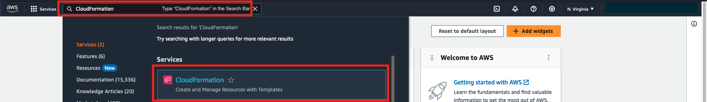
#### Figure 2: Navigate to the CloudFormation Console

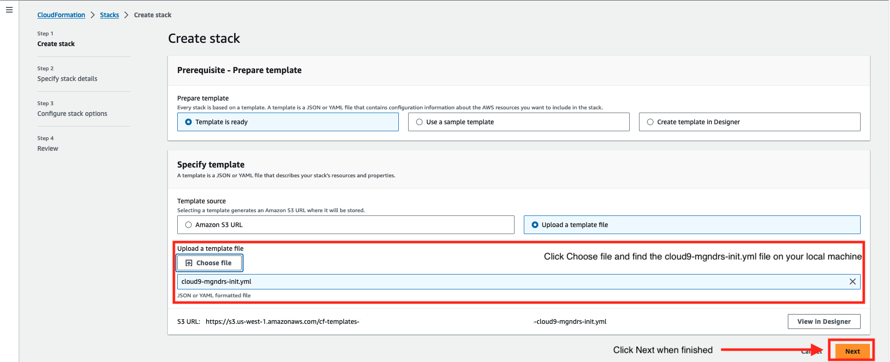
#### Figure 3: Create a CloudFormation Stack


#### Figure 4: Choose AWS Cloud9 CloudFormation Template

Choose the desired parameter values, or leave the defaults where
applicable. Please note, **all Stack parameters require a value and all
have a default value**. Figure 5 contains an example from the
CloudFormation Create stack console, along with details for each
parameter:

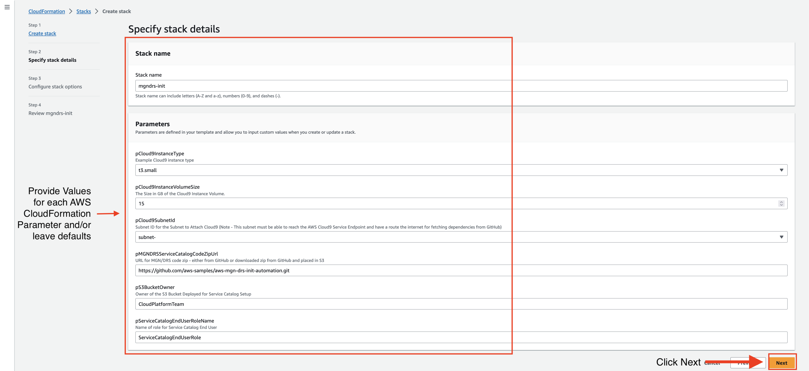
#### Figure 5: CloudFormation Create Stack Console

1.  **pCloud9InstanceType** - Dropdown list including t family EC2
    instance types.
2.  **pCloud9InstanceVolumeSize** - Numeric field for the instance
    volume size (in GB) for the AWS Cloud9 instance.
3.  **pCloud9SubnetId** - AWS-specific CloudFormation parameter for
    Subnet ID. Note: This subnet must have a route to the internet which
    allows the AWS Cloud9 instance to reach the AWS Cloud9 Service
    Endpoint and for fetching dependencies from GitHub.
4.  **pMGNDRSServiceCatalogCodeZipUrl** - Text field for the URL of the
    zipped solution code. This will be downloaded by the AWS Cloud9
    instance to perform solution setup activities, which include
    creating other CloudFormation Stacks and AWS resources. The value
    defaults to the GitHub repo Zip download URL.
5.  **pS3BucketOwner** - Text field used to tag the S3 Bucket deployed
    for Service Catalog setup with an Owner tag.
6.  **pServiceCatalogEndUserRoleName** - Text field used to name the
    Service Catalog End-User role that is created for this solution.

After creating the AWS Cloud9 stack, you'll see three additional stacks
get created during the process: **Service-Catalog-Product-S3**,
**IAM-Service-Catalog-Launch-Constraint**, and
**MGN-DRS-Init-Service-Catalog**. After these stacks are created
successfully the AWS Cloud9 stack will also be marked as
**CREATE_COMPLETE**. Please note: This process will take approximately
10 minutes to complete. During this time, the AWS Cloud9 CloudFormation
stack status will be **CREATE_IN_PROGRESS**. Upon completion of the
Stack creation, the following resources should be created: Note: To find
resources deployed in the AWS account, navigate to the CloudFormation
console, click the desired stack, and click the Resources tab.

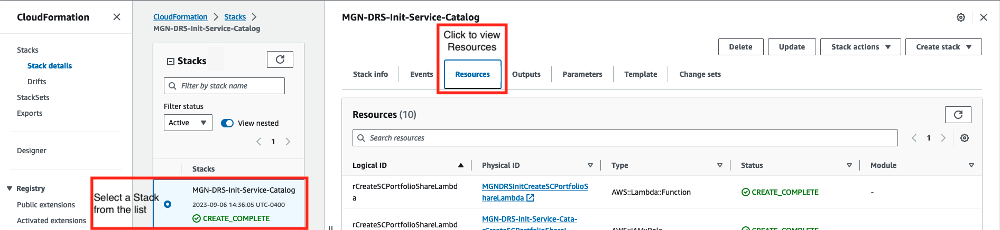
#### Figure 6: CloudFormation Stack -- Resources Tab

Figures 7, 8, and 9 show examples from the AWS Console.

-   S3 Bucket containing:
    1.  Packaged CloudFormation templates to create the AWS MGN and AWS
        DRS Service Catalog Products
    2.  Nested templates which the packed CloudFormation templates refer
        to

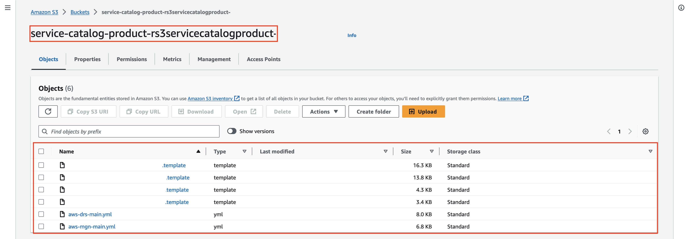
#### Figure 7: S3 Bucket with Packaged CloudFormation Templates

-   IAM Roles:
    1.  Service Catalog Product Launch Constraint
    2.  Service Catalog End User Role

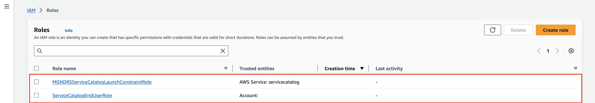
#### Figure 8: IAM Roles for Service Catalog

-   Service Catalog
    1.  Portfolio for AWS MGN and AWS DRS
        1.  Product for AWS MGN initialization and default replication
            configuration
        2.  Product for AWS DRS initialization and default replication
            configuration

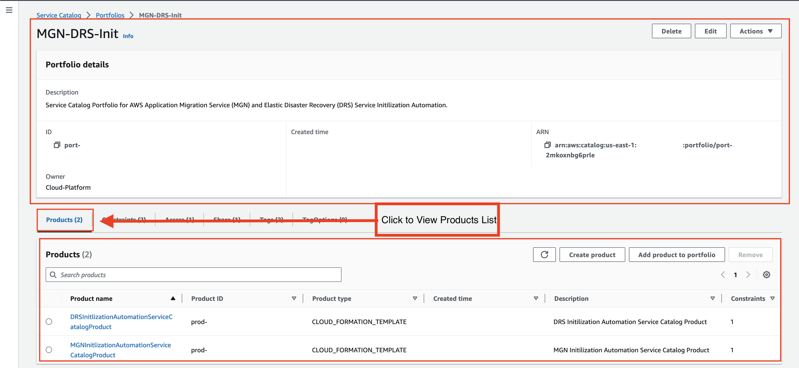 
#### Figure 9: Service Catalog Portfolio and Products for AWS MGN and AWS DRS Initialization

The Service Catalog Portfolio will be shared via your AWS Organizations
to all Accounts. In the CloudFormation console, click on your AWS Cloud9
Stack and click Outputs, then make note of the AWS Cloud9 Instance Role
ARN as that information will be used in the next step. Figure 10 shows
guidance for gathering the CloudFormation Output.

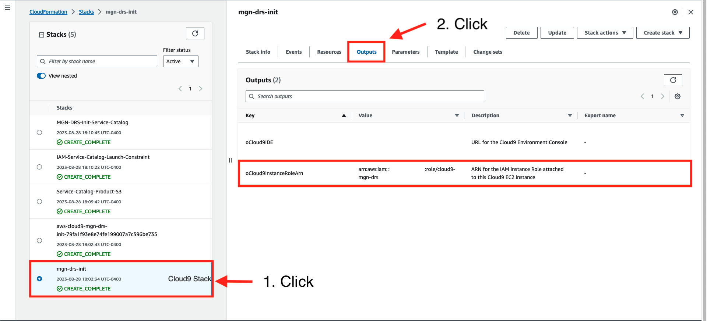
#### Figure 10: CloudFormation Stack Outputs

Move on to Step 2 to configure an AWS Organizations Member account and to
provision the Products.

### Step 2 - Validate or Create an IAM Role in the AWS Organizations Member Account and Deploy IAM Roles Required for Launching AWS MGN and AWS DRS Service Catalog Products

The AWS MGN and AWS DRS Service Catalog Portfolio you created in the
previous step will be automatically shared with all accounts in the AWS
Organizations, in the same region where you created the Portfolio in the
management account. Before the AWS MGN and AWS DRS Products are can be
provisioned , the AWS Organizations member account must be set up.
First, in the member account, create an IAM role which meets the
following criteria:

-   Has a trust policy that allows the EC2 Instance Role associated with
    the AWS Cloud9 Instance to assume it, for example:
    1.  Please note: the IAM Role ARN in the Principal element of the
        trust policy should be the CloudFormation Output
        **oCloud9InstanceRoleArn** you made note of in the previous
        step.

``` lang-json
{
    "Version": "2012-10-17",
    "Statement": [
        {
            "Sid": "Statement1",
            "Effect": "Allow",
            "Principal": {
                "AWS": "arn:aws:iam::<org_management_account_id>:role/cloud9-mgn-drs"
            },
            "Action": "sts:AssumeRole"
        }
    ]
}
```

-   Has permission policy to create IAM Roles and CloudFormation Stacks
    in the member account
    1.  For example, the AWS managed IAM policies called
        **IAMFullAccess** and **AWSCloudFormationFullAccess** will meet
        this requirement.

For instructions on how to create IAM roles, please follow the
instructions in: [Creating an IAM role
(console)](https://docs.aws.amazon.com/IAM/latest/UserGuide/id_roles_create_for-user.html#roles-creatingrole-user-console).
After creating the IAM role in member account, login to the
Organizations management account or the Service Catalog Delegated admin
account where you deployed the AWS Cloud9 stack. Then navigate to the
AWS Cloud9 Environment user interface by typing 'Cloud9' into the AWS
console search box as shown in Figure 11.

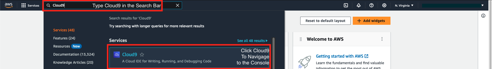
#### Figure 11: Open the AWS Cloud9 Console

Open the AWS Cloud9 environment IDE by clicking the Open as shown in
Figure 12.

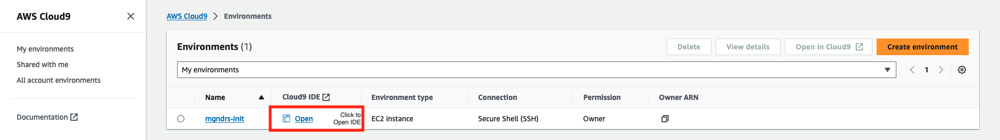
#### Figure 12: Open the AWS Cloud9 IDE

The AWS CLI on the previously deployed AWS Cloud9 Environment will be
used to assume this role in the member account. Then a script called
**service-catalog-shared-account-setup.sh **will be run from the AWS
Cloud9 Environment to create the required roles for Service Catalog in
the member account. The AWS managed temporary credentials must be
disabled as shown in the Figure 13: AWS Cloud9 Settings In AWS Cloud9,
choose the gear icon in top right corner to open a new tab and choose
the Preferences tab. Next, choose **AWS Settings** and toggle the **AWS
managed temporary credentials** setting to off, then close the
Preferences tab. Figure 13 shows the steps to change AWS Resources
settings in the AWS Cloud9 Environment.

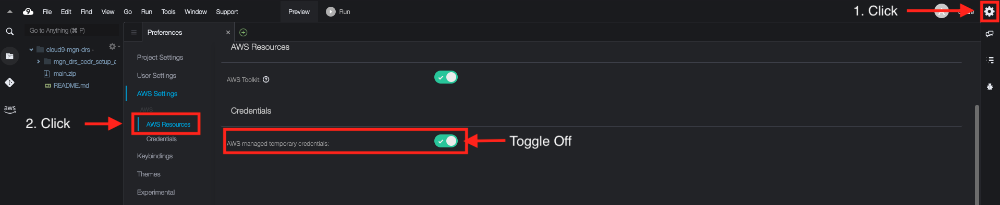
#### Figure 13: AWS Cloud9 Settings

Validate you are now assuming the instance role attached to the AWS
Cloud9 EC2 instance using the command below:

``` lang-bash
Admin:~/environment $ aws sts get-caller-identity
{
    "UserId": "AROAYEXAMPLEUSERIDMPG5DW:i-<instance_id>",
    "Account": "<account_id>",
    "Arn": "arn:aws:sts::<account_id>:assumed-role/cloud9-mgn-drs/<instance_id>"
}
```

Ensure the output of the command resembles what is above. Now, assume
this role in the member account using the following command:

``` lang-bash
aws sts assume-role --role-arn <arn_of_role> --role-session-name org-member-session
```

Using the output from the command above and the example below, set the
credentials in the terminal on the AWS Cloud9 instance:

``` lang-bash
export AWS_ACCESS_KEY_ID=<access_key_id>
export AWS_SECRET_ACCESS_KEY=<secret_access_key>
export AWS_SESSION_TOKEN=<session_token>
```

Next, `cd` to the **mgn_drs_setup_automation** directory if you are not
there already and run the following script:

``` lang-bash
./scripts/service-catalog-shared-account-setup.sh <region>
```

Use the same AWS Region where you deployed the AWS Cloud9 Environment in
the management account. This will deploy the required IAM roles for the
Service Catalog Launch Constraint and Service Catalog End User in that
account. Please note: IAM Role creation must only be performed once per
AWS Organizations member account.

### Step 3 - Initializing AWS MGN and AWS DRS Using Service Catalog Products in the Member Account

Using the AWS Console, login to the AWS Organizations member account. Once
logged in to member account, **Switch role** to the
**ServiceCatalogEndUserRole** that was created in previous step. See
Figures 14 and 15 for directions on how to Switch role in the AWS
Console. Account Id is the Account ID of the member account you are
logged into.

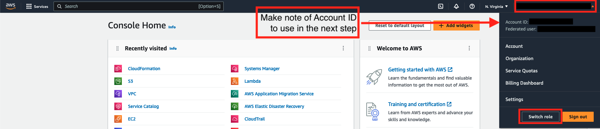
#### Figure 14: AWS Console -- Settings Switch role

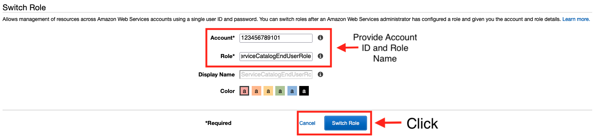
#### Figure 15: AWS Console -- Switch Role

In the same AWS region, you created the Portfolio in the management or
delegated administrator account using the AWS Cloud9 automation,
navigate to the Service Catalog Console. Click **Products** and you will
see the two Service Catalog Products shared with the Member account as
shown in Figure 16.

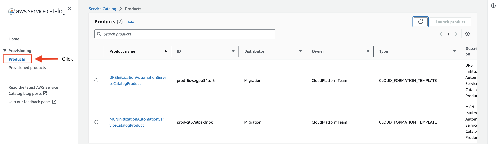
#### Figure 16: Service Catalog Products

Next, choose a Product and click the **Launch product** button. Provide
a name in Provisioned product name field, select a Product version (in
this case only v1 will be available), and fill in the values for the
parameters.

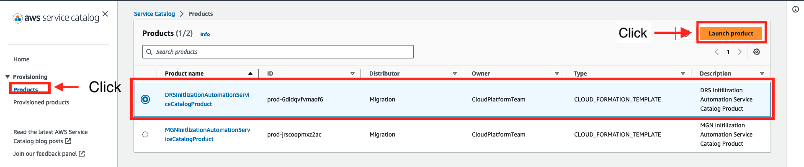
#### Figure 17: Launch Service Catalog Product

Please note: decide on a 'central' region for deploying IAM roles and
provide that region name in the central region used for conditionally
deploying IAM roles for AWS DRS and AWS MGN parameter. You will provide
this same region when you provision Products in other regions to ensure
the CloudFormation stack deploys IAM roles only once per account. Also,
a value is required for every Product parameter except for **KMS Key ARN
for EBS encryption**, which can be left blank or empty to use AWS
Managed KMS Keys, otherwise provide a Customer Managed Key ARN. Please
be sure the CMK resource policy allows use of the key by all principles
in your AWS account. When finished, click the **Launch product** button
at the bottom of the page. You will be automatically brought to the
details page of the Product you just provisioned. Wait for the Status to
read **Available**.

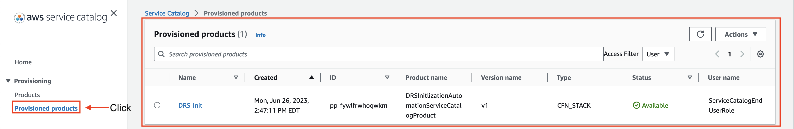
#### Figure 18: Service Catalog Provisioned products

To validate that the AWS MGN or AWS DRS service was initialized and
configured, switch to an IAM role with access to the AWS MGN or AWS DRS
service, and navigate to the service console in your AWS account. In the
example above, the AWS DRS service was initialized using the Service
Catalog Product. You should see the default replication settings on the
DRS service console match the information you provided when provisioning
the DRS initialization Service Catalog Product.

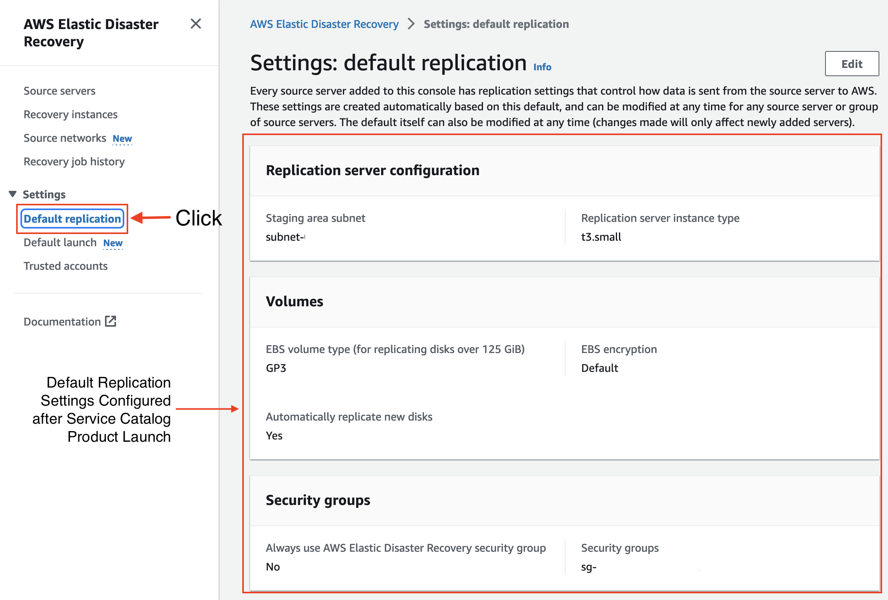
#### Figure 19: AWS DRS Default Replication Settings

Also, in the CloudFormation console, you will find two or three stacks,
which includes a main stack and nested stack(s). One nested stack for
IAM roles, if you chose the region you provisioned the Product in as the
'central' region, and one nested stack for the service initialization
and replication configuration automation.

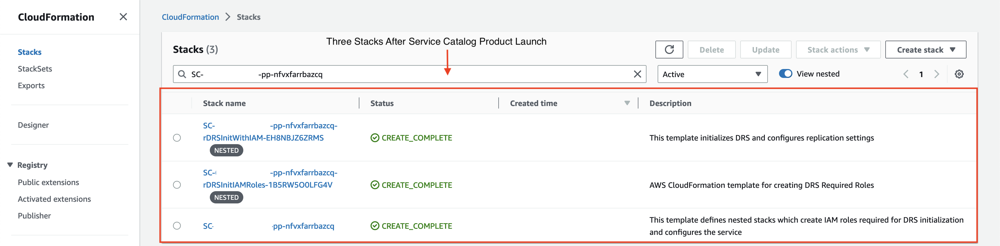
#### Figure 20: CloudFormation Stacks

At this point, you should now be ready to utilize the AWS MGN or AWS DRS
service in your account in the region where you deployed the Service
Catalog product. If you need to initialize the AWS MGN or AWS DRS
service in other regions, you can provision the Service Catalog Product
in those regions to initialize the service in that region in your
account.

### Clean Up

To clean up the solution, first assume a role in the AWS Organizations
management or delegated administrator account where you created the AWS
Cloud9 instance and Amazon S3 bucket, IAM roles, and Service Catalog
resources. Navigate to the CloudFormation console in the region you
previously deployed the resources in this blog, and find
the **Service-Catalog-Product-S3** stack. In the Resources tab for this
stack find the **AWS::S3::Bucket** resource and click the link to
navigate to the bucket, make note of the bucket name, navigate to the
Buckets list, select the bucket, then select then click the Empty
button. Refer to Figure 21 for instructions.

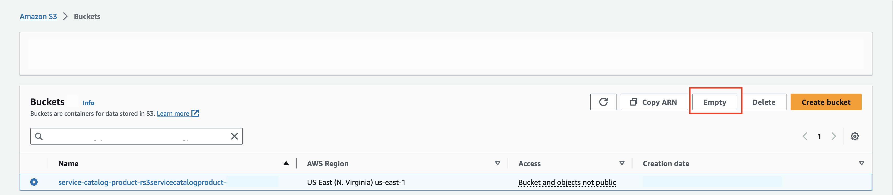
#### Figure 21: Empty Amazon S3 Bucket

Next, Navigate to the Service Catalog console. Click the AWS MGN and AWS
DRS initialization portfolio, and go to the Share tab. Here, select the
AWS Organizations ID share, click Actions and select Unshare. Refer to
Figure 22 for instructions.

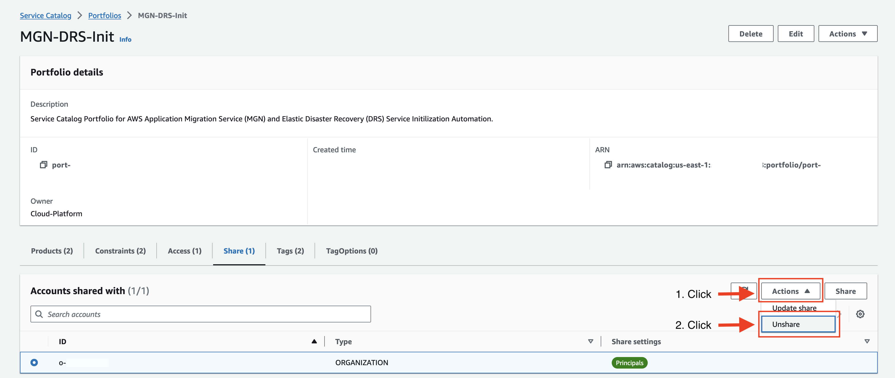
#### Figure 22: Unshare Service Catalog Portfolio

Navigate back to the CloudFormation console, and for each stack
(Service-Catalog-Product-S3, IAM-Service-Catalog-Launch-Constraint,
MGN-DRS-Init-Service-Catalog, and the AWS Cloud9 Stack) select each of
the stacks and click the Delete button. Refer to Figure 23 for
instructions.

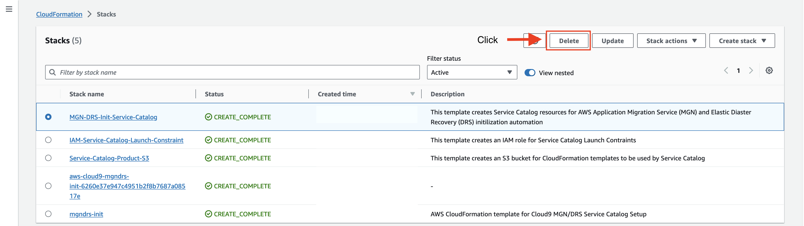
#### Figure 23: Delete CloudFormation Stacks -- AWS Organizations Management Account

Next, assume a role in the AWS Organizations member account. Navigate to the
CloudFormation console in the region you previously deployed the
resources in this blog, and find the
IAM-Service-Catalog-Launch-Constraint stack. Select the stack, then
select Delete. Refer to Figure 24 for instructions.

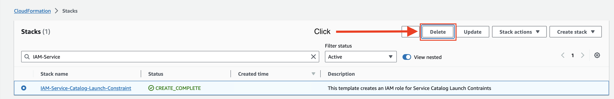
#### Figure 24: Delete CloudFormation Stacks -- AWS Organizations Member Account

In the AWS Organizations member account where the AWS MGN and/or AWS DRS
Service Catalog Products were provisioned, use the AWS CLI to assume an
existing role in the account with IAM permissions and run the following
commands:

1.  Assume Role

``` lang-bash
User:~/ $ aws sts assume-role --role-arn <arn_of_role> --role-session-name org-member-delete-blog-resources
```

1.  If AWS DRS Service Catalog Products were Provisioned

``` lang-bash
User:~/ $ aws iam remove-role-from-instance-profile --instance-profile-name AWSElasticDisasterRecoveryReplicationServerRole --role-name AWSElasticDisasterRecoveryReplicationServerRole

User:~/ $ aws iam remove-role-from-instance-profile --instance-profile-name AWSElasticDisasterRecoveryRecoveryInstanceRole --role-name AWSElasticDisasterRecoveryRecoveryInstanceRole 

User:~/ $ aws iam remove-role-from-instance-profile --instance-profile-name AWSElasticDisasterRecoveryConversionServerRole --role-name AWSElasticDisasterRecoveryConversionServerRole
```

1.  For AWS MGN Service Catalog Products were Provisioned

``` lang-bash
User:~/ $ aws iam remove-role-from-instance-profile --instance-profile-name AWSApplicationMigrationConversionServerRole --role-name AWSApplicationMigrationConversionServerRole

User:~/ $ aws iam remove-role-from-instance-profile --instance-profile-name AWSApplicationMigrationReplicationServerRole --role-name AWSApplicationMigrationReplicationServerRole 

User:~/ $ aws iam remove-role-from-instance-profile --instance-profile-name AWSApplicationMigrationLaunchInstanceWithSsmRole --role-name AWSApplicationMigrationLaunchInstanceWithSsmRole

User:~/ $ aws iam remove-role-from-instance-profile --instance-profile-name AWSApplicationMigrationLaunchInstanceWithDrsRole --role-name AWSApplicationMigrationLaunchInstanceWithDrsRole
```

Finally, assume the ServiceCatalogEndUserRole in the AWS Organizations
Member Account you deployed the Product(s) and navigate to the Service
Catalog console. Click Provisioned Products, select each Product you
provisioned and click Terminate, following the prompts to terminate the
provisioned Products. Refer to Figure 25 for instructions.

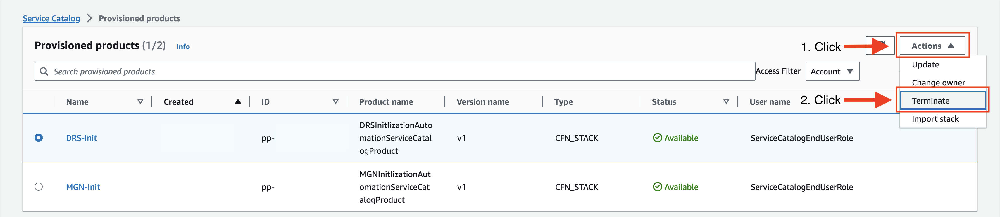
#### Figure 25: Terminate Service Catalog Product

### Summary
In this post, we showed how to automate initialization and default
replication configuration settings for both AWS Application Migration
Service and AWS Elastic Disaster Recovery by creating a Service Catalog
Portfolio with two CloudFormation Products. This solution provides
application or infrastructure teams a self-service way to initialize and
setup AWS MGN and/or AWS DRS, without administrator level access in the
AWS account. Additionally, the Service Catalog automation simplifies the
AWS MGN and AWS DRS setup by eliminating manual and error prone steps
and provides a consistent way to initialize these services in multiple
accounts and regions.